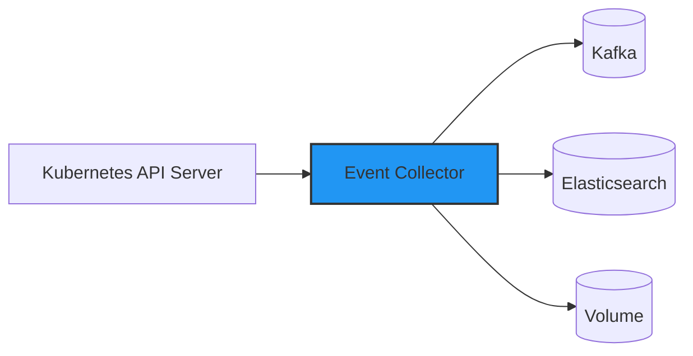

# event-collector
`event-collector`는 Kubernetes에서 발생하는 이벤트를 수집하여 Kafka, Elasticsearch, Volume 등에 저장하는 이벤트 로깅 시스템입니다. 이 프로그램은 Kubernetes 클러스터 내에서 발생하는 이벤트를 감지하고 다양한 데이터 저장소에 저장하여 이벤트를 분석하고 모니터링을 할 수 있도록 지원하는 시스템입니다.

## 주요 기능
* Kubernetes 이벤트 실시간 수집
* Kafka 스트리밍 데이터 전송
* Elasticsearch 데이터 저장
* Volume 데이터 저장 (파일 형태로 저장)

## 아키텍처

아키텍처 설명
1. Kubernetes API Server에서 이벤트를 수집합니다.
2. Event Collector는 수집한 이벤트를 수집합니다.
3. Event Collector는 Kafka, Elasticsearch, Volume에 이벤트를 저장합니다.

## 요구 사항
* Kubernetes 클러스터
* Kafka
* Elasticsearch (7.x 이상)
* Volume 마운트

## Test 환경 구성
### Kafka 설치
개인 PC의 리소스의 환경에 맞게 테스트 환경에 Strimzi Operator를 이용하여 Kafka를 KRAFT모드로 3대로 구성하였습니다.
```bash
# Strimzi Operator 설치
# Broker : 3
# CPU : 500m
# Memory : 1Gi
kubectl create ns mytest
helm repo add strimzi https://strimzi.io/charts/
helm repo update
helm upgrade --install -n mytest kafka-operator strimzi/strimzi-kafka-operator --version 0.45.0 -f ./middleware/strimzi.yaml

# Kafka Cluster 생성
kubectl apply -f ./middleware/kafka_cluster.yaml

# Kafka Topic 생성
kubectl apply -f ./middleware/kafka_topic.yaml
```

### Elasticsearch 설치
개인 PC의 리소스의 환경에 맞게 테스트 환경에 Elasticsearch를 node 3대로 구성하였으며 테스트 환경에 맞게 ILM 정책을 설정하였습니다.
```bash
# ElasticSearch 설치
# Node : 3
# CPU : 500m
# Memory : 2Gi
helm repo add elastic https://helm.elastic.co
helm repo update
helm upgrade --install --version 8.5.1 -n mytest elasticsearch elastic/elasticsearch -f ./middleware/elasticsearch.yaml

# elasticsearch ilm policy 생성
./middleware/elasticsearch_ilm.sh

# index template 생성
./middleware/elasticsearch_template.sh

# 초기 인덱스 생성
./middleware/elasticsearch_index.sh
```

## 설치 방법
### Event Collector 설치
```bash
# 이미지 빌드
docker build --platform linux/amd64 -t event-collector:latest -f ./Dockerfile .

# Kubernetes 배포
kubectl apply -f ./manifest/event-collector.yaml
```

## 프로젝트 소스 코드 구조
* cmd : 프로그램 application 소스 코드
  * collector : 이벤트 수집기 소스 코드
* pkg : 프로그램 application에서 사용하는 패키지 소스 코드
  * kube : Kubernetes API Server와 통신하는 패키지 소스 코드
  * logger : 로그를 수집하는 패키지 소스 코드
* exporter : 프로그램 application에서 사용하는 패키지를 외부로 전달하는 패키지 소스 코드
  * kafka : Kafka로 데이터를 전송하는 패키지 소스 코드
  * elasticsearch : Elasticsearch로 데이터를 전송하는 패키지 소스 코드
  * volume : Volume으로 데이터를 전송하는 패키지 소스 코드
* middleware : Kafka, Elasticsearch, Volume 등의 데이터 저장소 설정 파일
* manifest : Kubernetes 배포 파일 

---
# 추후 계획
* helm chart 작성
* 이벤트 필터링 기능 추가
* 이벤트 분석 기능 추가


